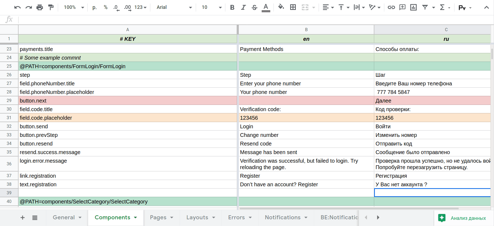

# gstranslate
Simple translation management tool for small and growing projects based on Google Spreadsheets



## Why?
- Existing solutions is expansive and their free tier includes only up to 1000 translation keys.
- Google Spreadsheet is comfortable enough to edit with many people in team, with great permission system,
  which allows to give permission for editors to edit only specified range.
  This is good place to have a discussion about translations and leave remarks.
  And it is free :p.

## How it works
1. You creates a Google Spreadsheets;
2. Configure permissions (spreadsheet must be accessible by direct link);
3. Writes your translations in google spreadsheet using our format;
  - You may use so many pages in one spreadsheet as you wish;
4. Configure environment variables for gstranslate;
5. When your translations is ready, you run `npx gstranslate` and it generates you `json` files for each language for which you created column in google spreadsheet.

## Usage
Recommended way to use **gstranslate** is to add command to your `package.json/scripts`
- `npx gstranslate -p Pages -p Components -p Errors`

### Environment
You need to add environment variable `GSTRANSLATE_KEY` to your environment.
You may use `.env` file for example - gstranslate loads it while starts.
(*Do not commit .env to repository*)

- `GSTRANSLATE_KEY` - could be found in url string for example: `https://docs.google.com/spreadsheets/d/`**F9F6WG19ga2BdsDhKrEOXnf6le2_hJfrJK_0fDAHn2L**`/edit#gid=71625432`

### CLI options
- `--pages|-p` - allow to pass pages list (**Required**)
- `--key` - allow to pass google spreadsheet key, alternative for `GSTRANSLATE_KEY`.
  (**Required**) *Do not commit key to repository*
- `--out-dir|-o` - allow to change output directory (**Default**: `./locals`)
- `--pretty-print` - use for pretty print output json (**Default**: `false`)
- `--delay` - sets delay between requests to pages in milliseconds (**Default**: `50`)

## Google Spreadsheet
Google spread sheet should have defined format

### Pagination
Maintain all translations on one page may be not so good idea - we recommend you
to group your translations in different pages. f.e. General, Components, Pages, etc...

### Header Line
Header line - is the first line on each page.
**WARNING** It should always be a comment (starts with `#`) to solve next 2 issues:
- Header line should not be part of final translations;
- *Composite Keys* from previous page should not have effect to the next one.

### Key column
The first column contains keys which could be used in your code.
Please name Key column starting with `#` symbol f.e. `# KEY`, that soles some issues.

Your translation keys could be names as you wish,
but we recommend to give it dot-separated name.
For example:
- `MyComponent.myField.title`
- `MyComponent.myField.placeholder`

### Language columns
The next to **Key** column should be one or more **language columns**.
First line of each column should contains a language code
which will be used as file name for generated translations (ex: `en.json`).
You could use something like `en`,`sv` or `en_US`, `sv_FI`
or any other format you wish.

**default language column** - is language column next to **Key** column.
Content of this cell will be used if translation in one of next columns is not specified.
That helps to avoid duplication of translations in cases
when translation for all languages should be the same.

*if you actually want to keep translation for some language empty - you should use
special keyword:* `<EMPTY>`, but in our experience it is rarely case.

### Comments
Each line(row) starts with `#` symbol will be ignored

### @PATH (Composite key)
`@PATH=` is special directive allow to make keys shorter.
Allow to avoid duplication, and make less changes in case you need to change keys.

When you specify `@PATH=pages/index` keys of next rows would be concatenated with
this PATH until to next comment line.

We are using the same directive in `webpack` which translates to path to component.

For now it is the only one directive. If you have another ideas of using them please
feel free to create an issue.

### Example of table for google spreadsheet
The next table demonstrates how translations look like in google spreadsheet

 \# KEY | en | ru
-----|----|----
some.kind.of.key | Default en translation | Русский перевод
some.another.key | The same translation for en and ru |
#some comment line | |
one.more.key | One more english | Ещё один русский
@PATH=pages/index | |
composite.key | Composite key will look like `pages/index/composite.key` |
composite.key2 | This will be `pages/index/composite.key2` | &lt;EMPTY&gt;

### Generated files
The above table will generate two files with next content:
#### en.json
```json
{
  "some.kind.of.key": "Default en translation",
  "some.another.key": "The same translation for en and ru",
  "one.more.key": "One more english",
  "pages/index/composite.key": "Composite key will look like `pages/index/composite.key`",
  "pages/index/composite.key2": "This will be `pages/index/composite.key2`",
}
```
#### ru.json
```json
{
  "some.kind.of.key": "Русский перевод",
  "some.another.key": "The same translation for en and ru",
  "one.more.key": "Ещё один русский",
  "pages/index/composite.key": "Composite key will look like `pages/index/composite.key`",
  "pages/index/composite.key2": ""
}
```

## Environment variables (DEPRECATED)
You may create `.env` file in your project directory (do not commit it to repository)
and specify next variables in format (`KEY=VALUE`):
- `TRANSLATION_KEY` - is a google spreadsheet key (**Required**) **[Deprecated]**
- `TRANSLATION_PAGES` - is comma-separated list of pages in google spreadsheet (**Required**) **[Deprecated]**
- `TRANSLATION_PRETTY` - makes output format pretty-printed json (**Default:** `false`) **[Deprecated]**
- `TRANSLATION_DIR` - directory for output translation files (**Default:** `./locales`) **[Deprecated]**

## Useful conditional formatting for google spreadsheet
We are using next conditional formatting rules in our spreadsheets
### Comments
- **Range:** `A:C`
- **Formula:** `=LEFT($A1) = "#"`
- **Color:** Light Green
### @PATH
- **Range:** `A:C`
- **Formula:** `=LEFT($A1;6) = "@PATH="`
- **Color:** Green
### Duplicated translations in one row
- **Range:** `A:C`
- **Formula:** `=AND(LEFT($A1) <> ""; AND($B1 = $C1; $B1 <> ""))`
- **Color:** Orange
### Default translation missed
- **Range:** `A:C`
- **Formula:** `=AND(LEFT($A1) <> ""; AND($B1 = ""; $C1 <> ""))`
- **Color:** Red

## Contribution
If you would like to contribute - please do not make PR with breaking changes, and start with issue.

## License
MIT
